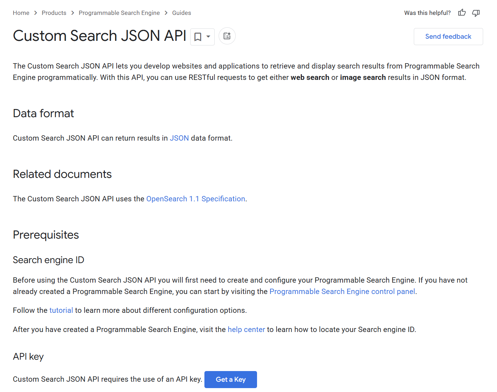
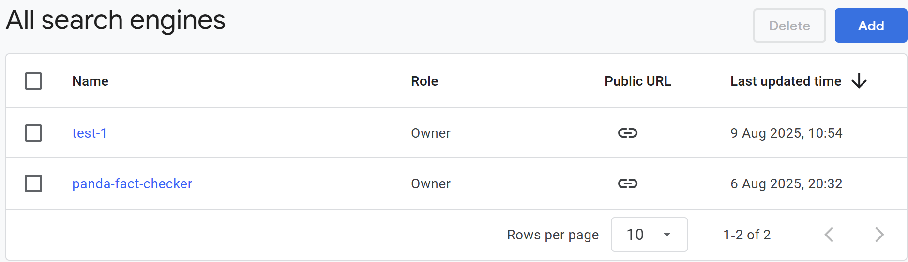
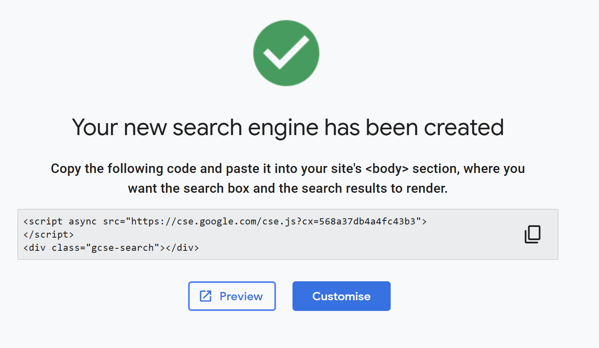
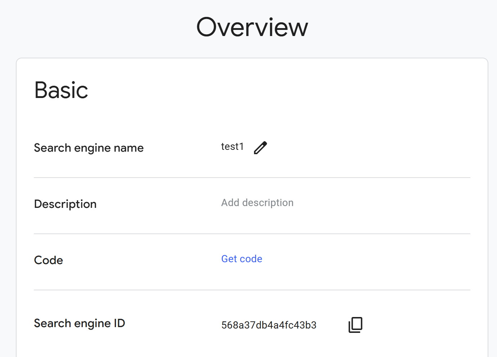
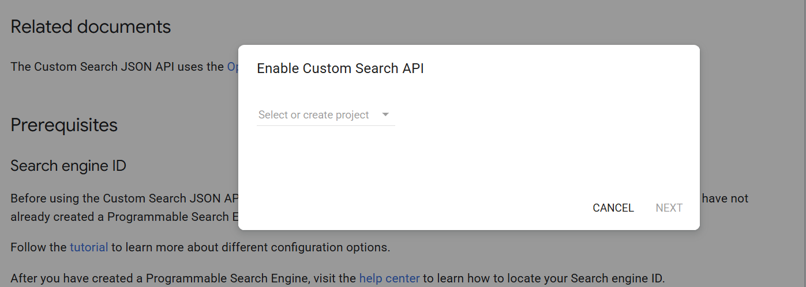
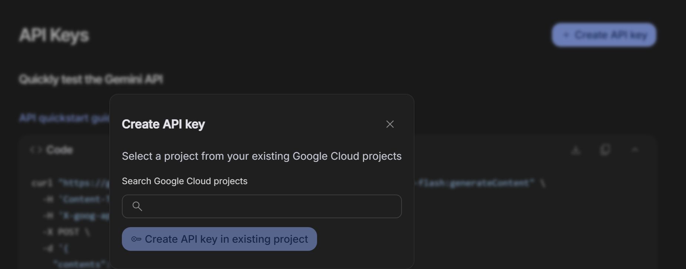
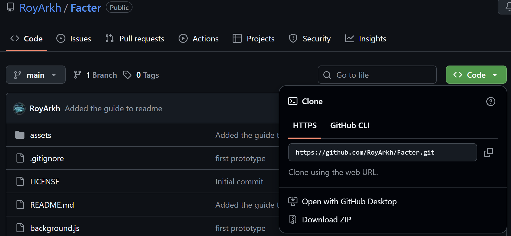
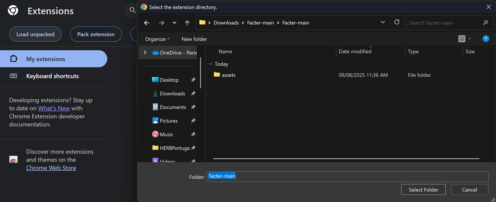

# Facter

## TODO
- [x] Add the full guide in readme
- [x] Update readme with full description of the project.
- [x] Upgrade UI
- [x] Create a presentation
- [ ] Make a demo video
- [ ] Add logout button
- [ ] Change guide button

## Mission 

Facter was born from the need to simplify the process of verifying information encountered online. In an age where misinformation spreads quickly, students and researchers are often left spending excessive time manually cross-checking claims against credible sources. This not only interrupts their workflow but can also make rigorous verification feel tedious. Facter solves this by combining customizable search capabilities with AI-powered analysis, enabling users to highlight or paste a statement and instantly see a verdict supported by relevant references.

The project’s mission is to empower users with a flexible fact-checking environment that adapts to their unique research needs. By allowing the integration of a custom search engine, Facter can be tailored to specific domains, whether that’s scientific journals, legal resources, historical archives, or trusted news outlets. For general use, it can be set to search broad sites like Wikipedia or Google Scholar, enabling a quick and accessible general-purpose fact-checker. This flexibility makes it valuable for both specialized academic work of students and everyday information verification.

The usefulness of Facter lies in its balance between precision and convenience. Instead of requiring users to sift through countless search results, it automatically gathers snippets from curated sources and uses an AI model to interpret and summarize the consensus. The result is an easy-to-read verdict, supplemented by direct links to top supporting references. This design not only helps users make informed decisions faster but also reinforces critical thinking by showing the evidence behind each conclusion, making it a powerful tool in the fight against misinformation.

In cases where the results do not dictate any single coherent story, that is when different sources seem to provide different information, Facter gives the power to the user. This project is not meant to be your "holy grail of all answers" that you will blindly follow. The whole point is to encourage critical thinking, be that within the website that the user tries to fact check or the results that Facter provides. 

## User's Setup guide
### Your Engine
Your engine - is going to be the broad ddatabase of information that is going to be useful to you. If you want to use Facter for general fact checking it makes sense to include trusted sources like FactCheck.org or community websites like Wikipedia which have a lot of infromation. Many countries have a lis of trusted sources with regards to their regions, you can find those online.

### How to setup the engine
First choose the sources that will be suitable for you goal. For example for this test scenario I will choose the following:
- *.wikipedia.org/*
- cloud.google.com/*
- www.encyclopedia.com/*

Then head to https://developers.google.com/custom-search/v1/overview

Here you will see the following page with instructions:

Click on "Programmable Search Engine control panel" (this will take you to https://programmablesearchengine.google.com/controlpanel/overview) and there click on "Add"

Name your engine, paste the websites you previously decided on, then click on "Create". 

You will get a confirmation screen, there click on Customize and in the page that opens in the overview you will see your search engine ID. Save that.

Great! Now you have your search base!

### The engine API key

Return to the previous page (https://developers.google.com/custom-search/v1/overview) and in the API key section press on "Get a Key". API keys bound to a service account provide the identity and authorization of the service account to a request, so this key will be your unique identifier for this service. 

In the "Select or create project" choose "create a new project" and give it a name. Then press next. 
 

You will be shown a button "SHOW KEY". Press that and save your new API key. Make sure it is stored securely.

### Gemini access

While Facter can we user without AI, it makes the user experience much more complete. Therefore, you need to go to https://aistudio.google.com/app/apikey click on "Create API key" and choose the project we previously created. 

Save your API key and store it safely. 

**You are all set!** 

### Using in Chrome

Now for easy use you can just download the zip of this repo by clicking on "Code" and "Download zip". Unzip it into any empty place in your computer. 

Press "Extract all" 

Then go to chrome://extensions/ in chrome. Press load unpacked and choose the folder to which you unzipped the repo. After it gets added 

**Use Facter, stay true.**

